# LifeMosaic - 프로젝트 포트폴리오


---

# 🚀 프로젝트 개요

#### LifeMosaic은 기본적인 CRUD 기능을 갖춘 게시판을 만들기 위한 팀 프로젝트입니다.

 - 여러 명의 팀원이 참여하여 개발한 결과물로, 사용자가 간편하게 게시글을 작성하고 관리할 수 있는 게시판 시스템을 제공합니다.

# 💻 개발 환경 및 도구 
- 언어: JAVA
- 데이터베이스: Oracle
- 프레임워크: Spring
- 프론트엔드: JSP, HTML, CSS, JS
- 형상 관리: GIT

#
  
### 프로젝트 개발 과정:

- 주제 선정
- ERD 설계 (ERD 이미지)
- Database 구축
- Spring 프로젝트 진행
- 취합 및 에러 처리


# 🛠️ 프로젝트 역할

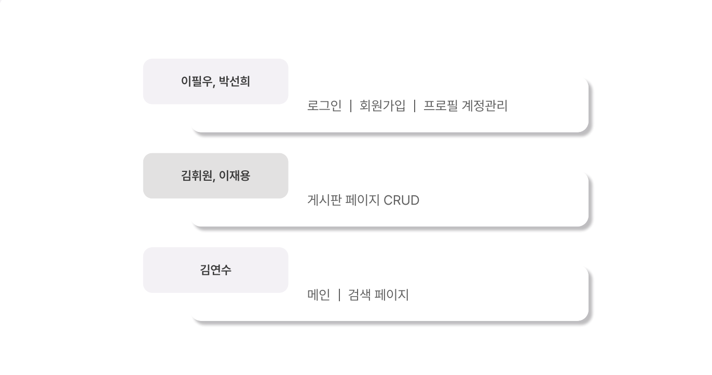

# ⚙️ 주요 기능
- 게시글 작성, 수정, 삭제 (CRUD)
- 게시글 검색 및 계정, 프로필 관리
- 프로필 이미지 변경 및 북마크 기능
- 댓글, 대댓글 작성 및 조회, 대댓글 사용자 태그 명확화
- 사용자 간 소통을 위한 좋아요, 싫어요 기능
- 
# 🛠️ 프로젝트 

## 홈 화면

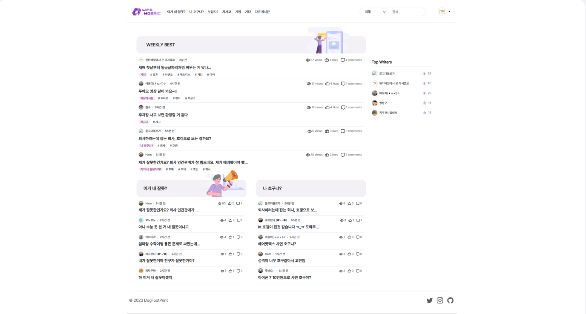

## 메인 페이지
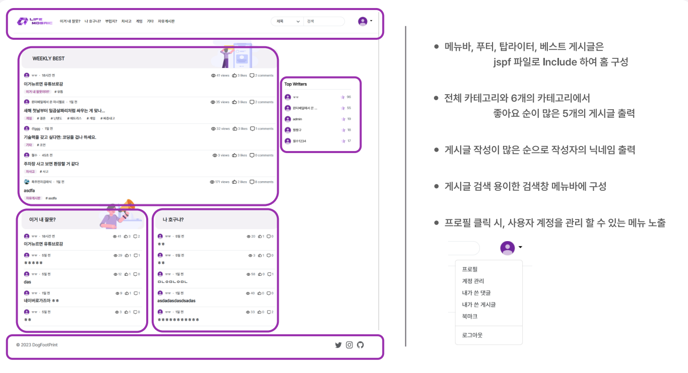

## 로그인 페이지
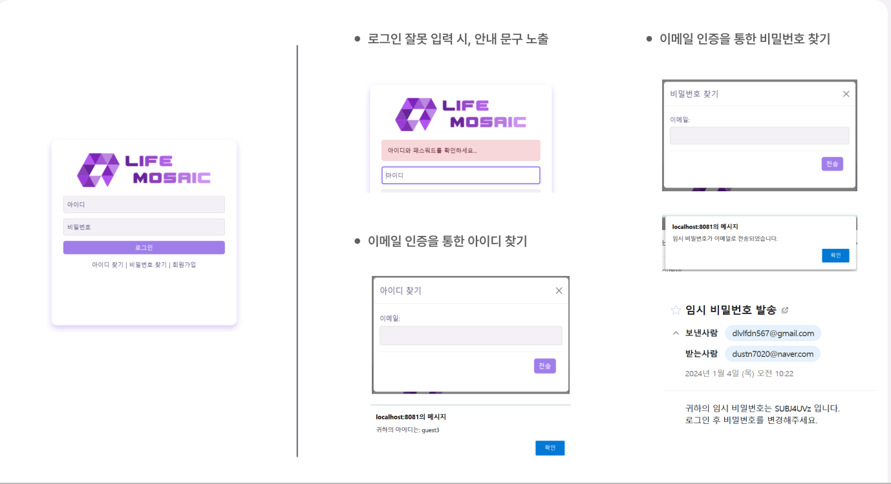

## 회원가입 페이지

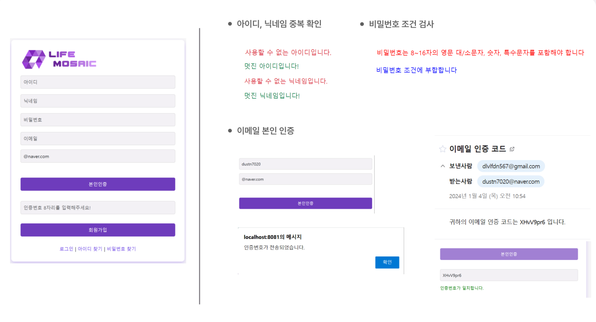

## 마이 페이지

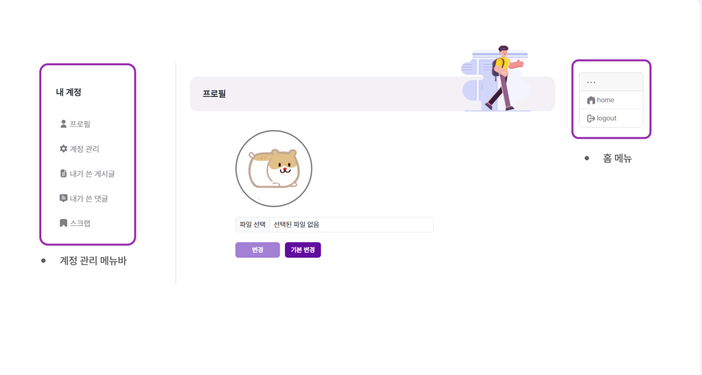

## 마이 페이지 (프로필)

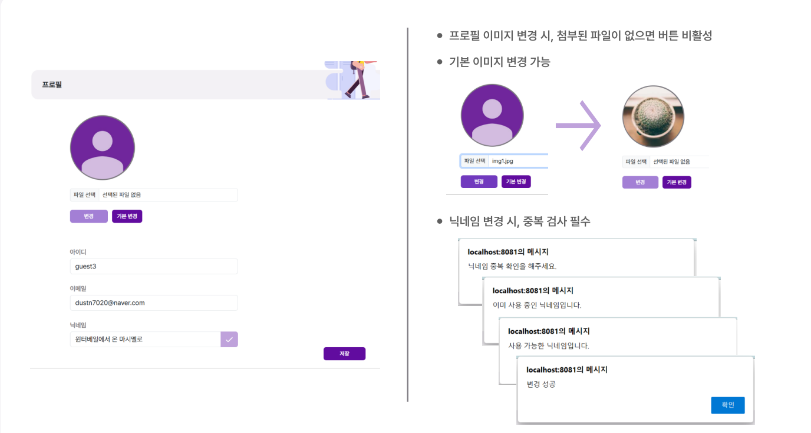

## 마이 페이지(계정관리 및 스크랩)

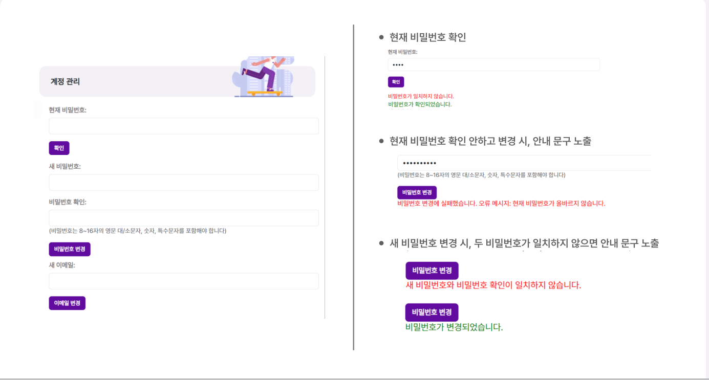
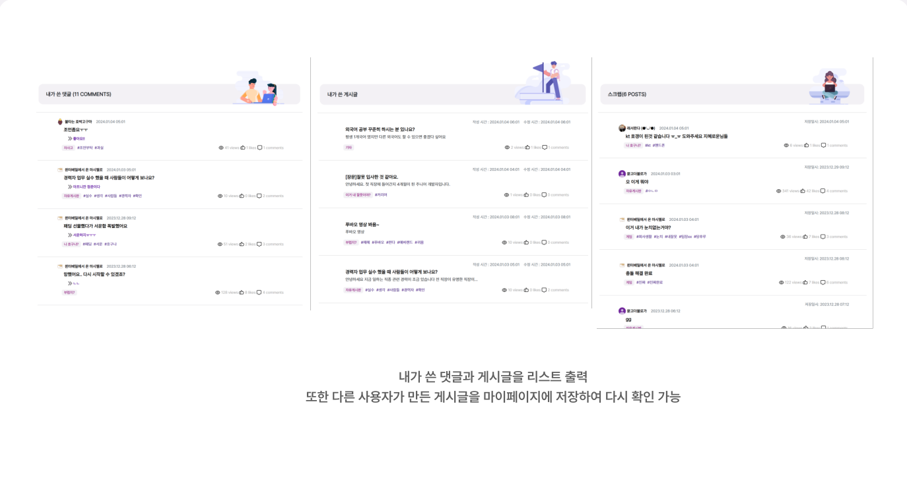

## 회원 게시글 페이지

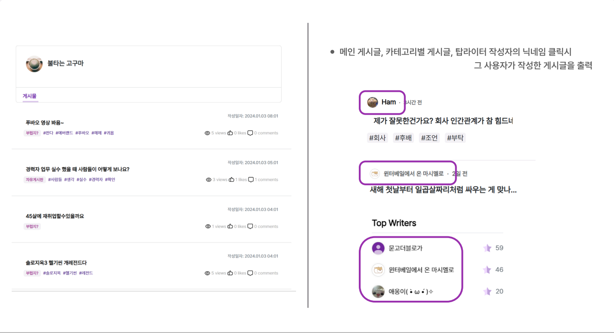

## 게시판 리스트 페이지

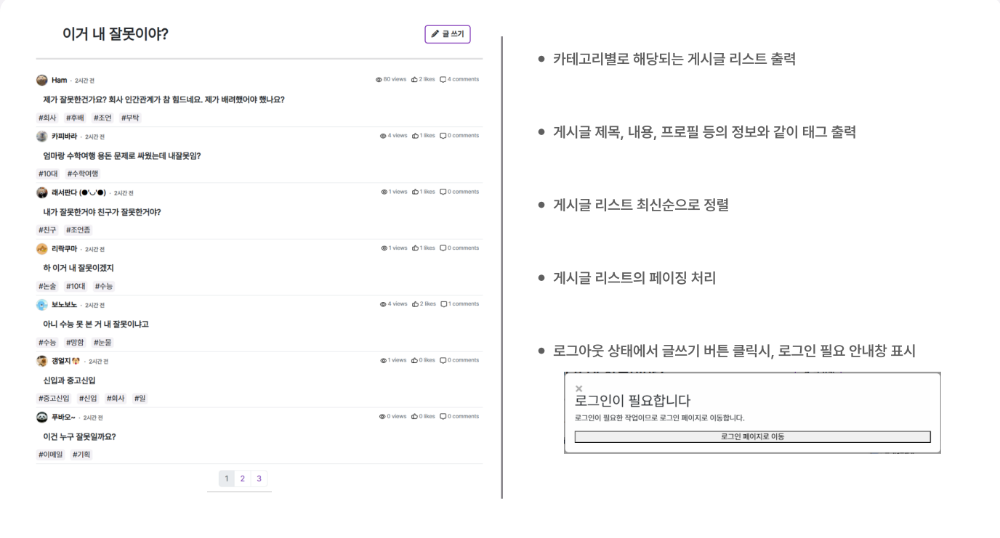

## 글 작성 페이지

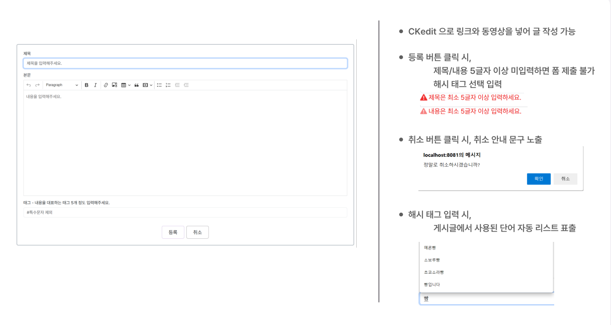

## 글 수정 페이지 

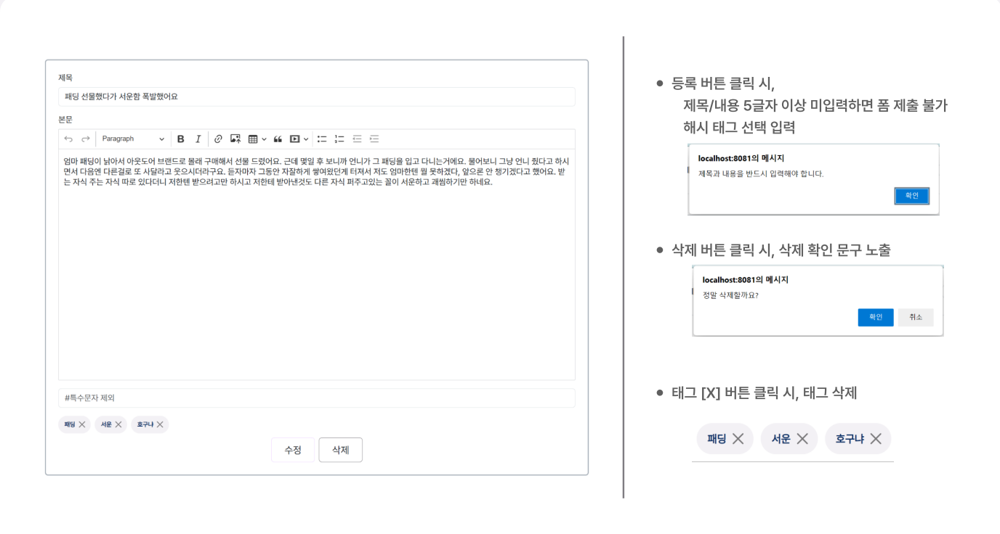

## 글 상세 페이지

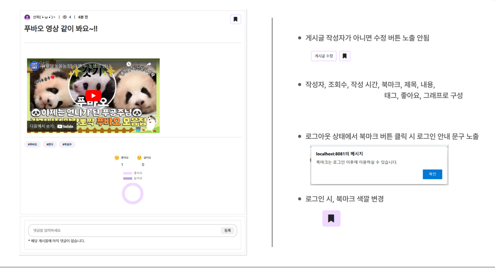

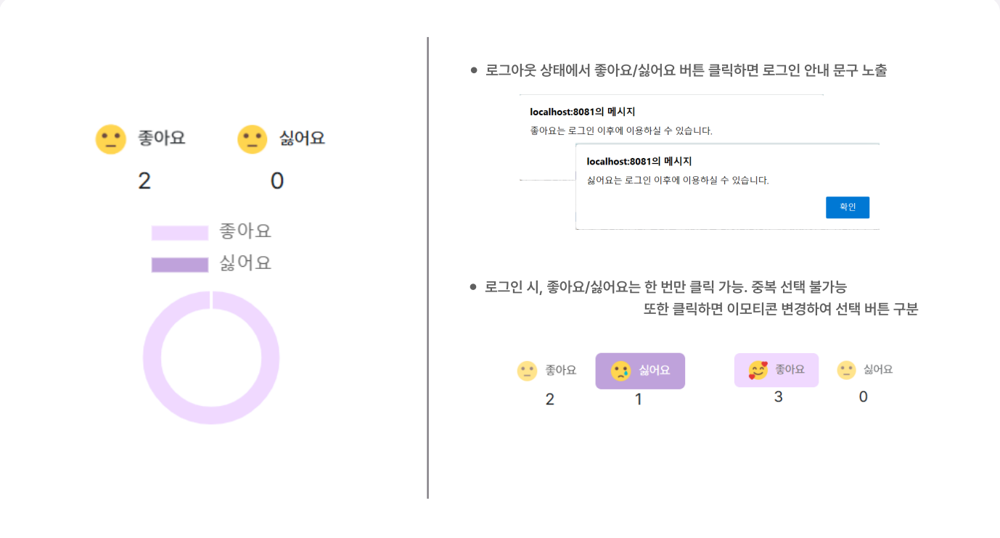

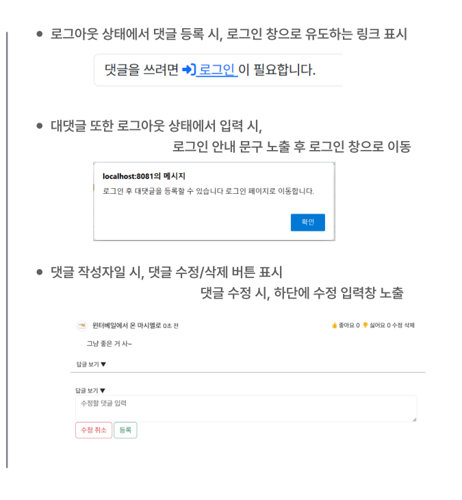

## 검색 페이지

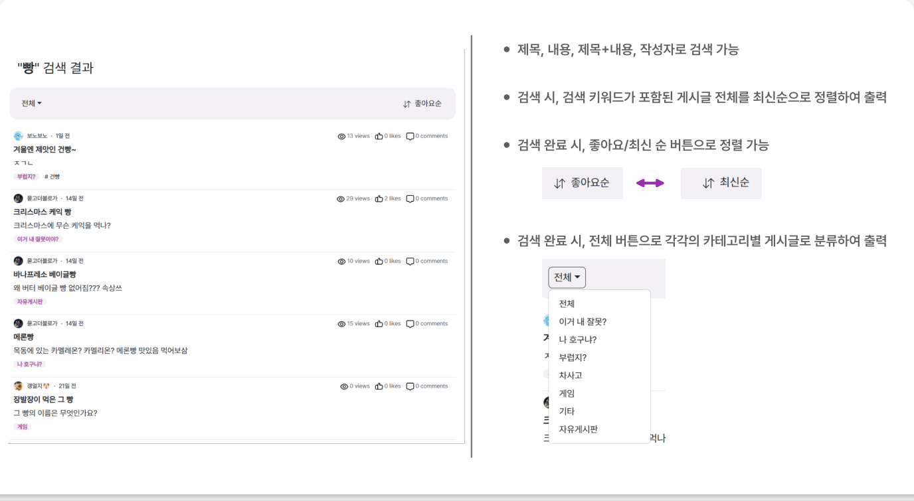
  


##  담당 업무

### 좋아요 싫어요 수정 그래프 수치화 즉시반영 및 중복 선택 불가능
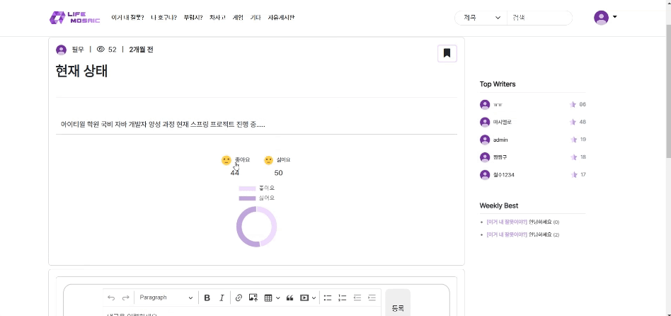
```javascript
// Chart.js 라이브러리를 이용하여 생성된 도넛 차트(Donut Chart)를 관리하는 부분.

// 1. 이전에 생성된 "donutChart"라는 이름의 차트 객체를 가져옴.
const existingChart = Chart.getChart("donutChart");

// 2. 가져온 차트 객체가 존재하는 경우에만 다음의 코드를 실행.
if (existingChart) {
    // 3. 이전 차트를 파괴(destroy)하여 제거.
    existingChart.destroy();
}


```

### 에디터를 이용한 상세보기 시 클릭한 링크로 이동 및 동영상 추가 (Youtube video)
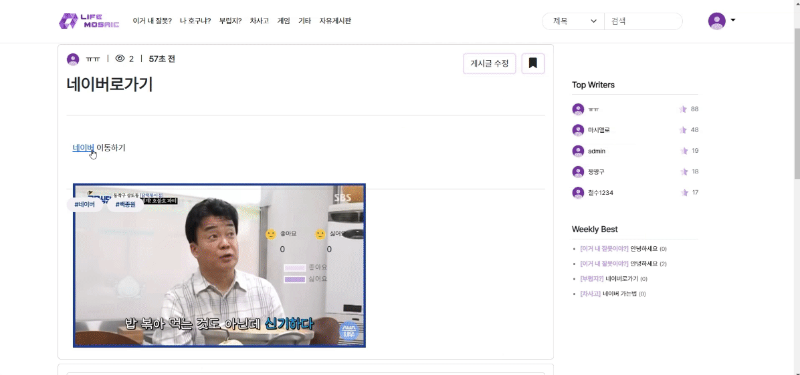
```javascript

// 동영상

// DOMContentLoaded 이벤트가 발생하면 실행되는 함수
document.addEventListener('DOMContentLoaded', function() {
  // 동영상이 포함된 oembed 태그를 찾음.
  const oembedTag = document.querySelector('oembed[url^="https://www.youtube.com"]');

  // oembed 태그가 존재하는 경우
  if (oembedTag) {
    // oembed 태그의 url 속성을 통해 YouTube 동영상의 URL을 가져옴.
    const youtubeUrl = oembedTag.getAttribute('url');

    // YouTube 동영상의 ID를 추출.
    const videoId = youtubeUrl.match(/watch\?v=([^&]+)/)[1];
    
    // YouTube 동영상 ID가 추출되는 경우
    if (videoId) {
      // YouTube 동영상을 표시할 HTML 코드를 생성.
      const iframeHtml = `<iframe width="560" height="315" src="https://www.youtube.com/embed/${videoId}" frameborder="0" allow="autoplay; encrypted-media" allowfullscreen></iframe>`;

      // 생성한 HTML 코드를 figure 요소 안에 삽입.
      const figureElement = document.getElementById('youtube-video');
      figureElement.innerHTML = iframeHtml;
    }
  }
});

// 링크

// DOMContentLoaded 이벤트가 발생하면 실행되는 함수
document.addEventListener('DOMContentLoaded', function() {
  // content 요소의 click 이벤트를 처리하는 함수
  document.getElementById('content').addEventListener('click', function(event) {
    // 클릭된 요소를 찾음.
    const clickedElement = event.target.closest('a');

    // 클릭된 요소가 링크인지 확인
    if (clickedElement && clickedElement.getAttribute('href')) {
      event.preventDefault(); // 기존의 링크 이동 동작을 막음

      // 클릭된 요소의 href 속성값을 추출.
      const clickedUrl = clickedElement.getAttribute('href');
      console.log('클릭된 링크:', clickedUrl);

      // 클릭된 링크가 http:// 또는 https://로 시작하는지 확인
      if (clickedUrl.startsWith('http://') || clickedUrl.startsWith('https://')) {
        window.open(clickedUrl, '_blank'); // 새 창을 열어 링크 이동
      } else {
        // 프로젝트 경로와 상관없이 도메인만 추출하여 이동
        // 이걸 쓰는 이유는 이코드를 작성하지않으면 프로젝트 경로 + 네이버 로이동되기떄문에 에러페이지가 나오기때문에
        const domain = clickedUrl.replace(/^(?:https?:\/\/)?(?:www\.)?/i, '');
        window.open('http://' + domain, '_blank'); // 새 창을 열어 도메인 이동
      }
    }
  });
});


```

### 댓글, 대댓글 CRUD 및 태그 명확화
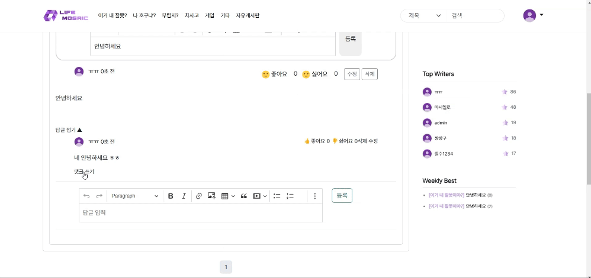
### 🚨 
- 알 수 없는 오류로 comment.js 가 열리지않아 코드 첨부가 어려움..
- 최종 커밋을 못했기 때문에 해결하면 올릴예정입니다
```javascript

// 댓글 및 게시글 대댓글 전부 년월일이 아닌 시간으로 변경

/**
 * 입력된 날짜와 현재 시간의 차이를 계산하여, 몇 초, 분, 시간, 일, 월, 년 전인지를 문자열로 반환하는 함수.
 * @param {Date} date - 비교할 날짜.
 * @returns {string} - 계산된 결과에 따른 문자열.
 */
function timeAgo(date) {
  // 현재 시간과 입력된 시간의 차이(초 단위)를 계산.
  const seconds = Math.floor((new Date() - date) / 1000);

  // 초 단위 간격으로 몇 초 전인지 계산.
  let interval = Math.floor(seconds / 60);
  if (interval < 1) {
    return `${Math.floor(seconds)}초 전`;
  }

  // 분 단위 간격으로 몇 분 전인지 계산.
  interval = Math.floor(seconds / 3600);
  if (interval < 1) {
    return `${Math.floor(seconds / 60)}분 전`;
  }

  // 시간 단위 간격으로 몇 시간 전인지 계산.
  interval = Math.floor(seconds / 86400);
  if (interval < 1) {
    return `${Math.floor(seconds / 3600)}시간 전`;
  }

  // 일 단위 간격으로 몇 일 전인지 계산.
  interval = Math.floor(seconds / 2592000); // 평균 월 길이: 30.44일
  if (interval < 1) {
    return `${Math.floor(seconds / 86400)}일 전`;
  }

  // 월 단위 간격으로 몇 개월 전인지 계산.
  interval = Math.floor(seconds / 31536000); // 평균 년 길이: 365.24일
  if (interval < 1) {
    return `${Math.floor(seconds / 2592000)}개월 전`;
  }

  // 년 단위 간격으로 몇 년 전인지 계산.
  return `${interval}년 전`;
}

```

### 사용자 편의성 에러 핸들러 페이지
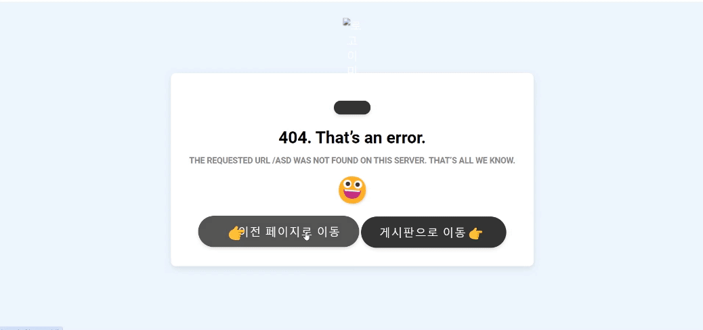

```xml

<!-- web.xml 파일에 등록된 설정으로, 각각의 에러 코드에 대해 "/error" 경로로 이동. -->

<error-page>
    <error-code>404</error-code>
    <location>/error</location>
</error-page>

<error-page>
    <error-code>405</error-code>
    <location>/error</location>
</error-page>

<error-page>
    <error-code>500</error-code>
    <location>/error</location>
</error-page>

<error-page>
    <error-code>400</error-code>
    <location>/error</location>
</error-page>

```
```java
// CustomError 클래스는 Spring Framework에서 사용자 정의 에러 페이지를 설정하는 역할.
@Controller
public class CustomError {
    
    // "/error" 경로로 GET 요청이 들어왔을 때, 사용자 정의 에러 페이지로 이동하는 메서드.
    @GetMapping("/error")
    public String goErrorPage() {
        // "error/error"로 뷰를 반환하여 사용자에게 에러 페이지를 보여준다.
        return "error/error";
    }
}
    
```


# 💭 느낀 점
프로젝트를 통해 팀원들과의 협업, 기능 구현, 디자인 등 다양한 경험을 쌓을 수 있었습니다. 특히, 사용자 중심의 디자인과 좋은 UX를 고려한 결과물을 만들 수 있어 뿌듯하게 생각합니다. 프로젝트를 진행하면서 첫 번째 프로젝트에서는 하나의 기능에 너무 많은 시간을 할애하여 팀원들에 비해 뒤쳐진 느낌을 받았습니다. 그러나 이 경험을 토대로 현재 진행 중인 두 번째 프로젝트에서는 스프링 시큐리티 개념을 공부하여 첫번 쨰 프로젝트에 비해 시간을 적게 사용하여 소셜 로그인을 구현하는 데에 성공하였습니다.

# 🚀 개선점
- 코드의 효율성 개선
- 댓글 대댓글 좋아요 싫어요 기능 보완
- UI/UX 측면에서의 보완
- CKeditor 사진 기능 사용을 못하여 개인프로젝트로 할 예정입니다


# 🚀 프로젝트 GitHub

[LifeMosaic github](https://github.com/gangdev567/lifemosaic333)